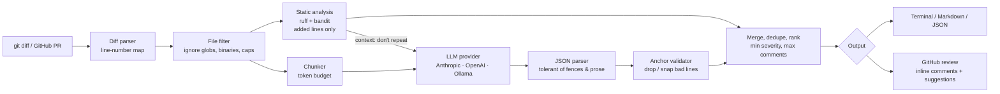

# 🛡️ PR Sentinel

**LLM-assisted pull request reviewer.** PR Sentinel combines deterministic static analysis (ruff and bandit) with a pluggable LLM (Claude, OpenAI or a local Ollama model) and posts the review as inline comments on GitHub pull requests. It runs as a **GitHub Action** or as a **CLI** on any local git diff.


```
$ pr-sentinel review --base main
[HIGH    ] app/payments.py:6   Hard-coded credential
[HIGH    ] app/payments.py:16  Call to requests with verify=False disabling SSL certificate checks (bandit:B501)
[HIGH    ] app/payments.py:24  subprocess call with shell=True identified (bandit:B602)
[MEDIUM  ] app/payments.py:10  Possible SQL injection via string-built query (ruff:S608)
[MEDIUM  ] app/payments.py:14  Mutable default argument (ruff:B006)
...
```

See [`examples/sample-review.md`](examples/sample-review.md) for the summary comment this produces on a PR.

---

## Why it exists

LLM code reviewers have three well-known failure modes. PR Sentinel is built around fixing them:

| Problem | How PR Sentinel handles it |
|---|---|
| **Hallucinated line numbers.** GitHub rejects the *whole* review if one comment points outside the diff. | The diff parser maps every line in the new file. Each LLM finding is validated against that map, snapped to the nearest valid line if it's within ±3 lines, and dropped otherwise. If GitHub still rejects the batch, comments are posted one by one and any that fail are folded into the summary. |
| **Noise.** LLMs repeat what linters already say and leave style nitpicks. | Static analysis runs first. Its findings go into the prompt under "already reported, don't repeat", and LLM findings on the same line and category are removed. Ruff and bandit duplicates (`S501` = `B501`) are collapsed into one. |
| **Vendor lock-in and cost.** | Providers sit behind a 20-line interface. You can switch between Claude, OpenAI (or any OpenAI-compatible endpoint) and a free, offline Ollama model with one env var. |

## Architecture



```
src/pr_sentinel/
├── diff.py             # unified diff → files/hunks, new-file line map
├── static_analysis.py  # ruff + bandit, filtered to added lines, deduped
├── prompt.py           # system/user prompts, chunking, robust JSON extraction
├── review.py           # ReviewEngine: orchestrates the pipeline
├── providers/          # LLMProvider ABC + Anthropic, OpenAI, Ollama, offline fake
├── github.py           # Actions event → PR, review API with per-comment fallback
├── render.py           # text / markdown / json output
├── config.py           # .pr-sentinel.yml + env overrides
└── cli.py              # `pr-sentinel review` / `pr-sentinel github`
```

## Quick start

### CLI

```bash
pip install -e ".[static]"          # [static] adds ruff + bandit

export ANTHROPIC_API_KEY=...        # or OPENAI_API_KEY, or run Ollama locally
pr-sentinel review                  # uncommitted changes vs HEAD
pr-sentinel review --base main      # your branch vs main
pr-sentinel review --staged --provider ollama --model qwen2.5-coder:7b
git diff | pr-sentinel review --diff-file - --format markdown

# Try it with no API key: the offline heuristic provider
pr-sentinel review --diff-file examples/payments.diff --provider fake --no-static
```

Use `--fail-on high` to make the command exit with status 1 when there's a finding at that severity or above. That lets it act as a quality gate in CI or a pre-push hook.

### GitHub Action

1. Add `ANTHROPIC_API_KEY` (or `OPENAI_API_KEY`) under **Settings → Secrets → Actions**.
2. Add `.github/workflows/pr-sentinel.yml`:

```yaml
on:
  pull_request:
    types: [opened, synchronize, reopened, ready_for_review]
permissions:
  contents: read
  pull-requests: write
jobs:
  review:
    runs-on: ubuntu-latest
    steps:
      - uses: actions/checkout@v4
        with:
          ref: ${{ github.event.pull_request.head.sha }}
      - uses: hamzaakrm/pr-sentinel@v1
        with:
          provider: anthropic
          fail-on: critical
        env:
          ANTHROPIC_API_KEY: ${{ secrets.ANTHROPIC_API_KEY }}
```

The action posts one review per push. It contains a summary table plus inline comments, and fixes appear as GitHub **suggestion blocks** you can apply with one click.

## Configuration

Create `.pr-sentinel.yml` in the repo root. Every key is optional:

```yaml
provider: anthropic        # anthropic | openai | ollama | fake
model: claude-sonnet-4-5
min_severity: low          # info | low | medium | high | critical
max_comments: 30
max_files: 25
static_analysis: true
focus: [bugs, security, performance, maintainability]
ignore: ["migrations/*", "*.generated.ts"]   # added to the built-in lockfile/binary ignores
extra_instructions: |
  We use SQLAlchemy 2.0. Flag any raw SQL string building.
fail_on: critical
```

| Env var | Purpose |
|---|---|
| `ANTHROPIC_API_KEY` / `OPENAI_API_KEY` | Provider credentials |
| `OPENAI_BASE_URL` | Any OpenAI-compatible endpoint (Azure, Groq, LM Studio, ...) |
| `OLLAMA_HOST` | Ollama server (default `http://localhost:11434`) |
| `PR_SENTINEL_PROVIDER`, `PR_SENTINEL_MODEL`, `PR_SENTINEL_MIN_SEVERITY`, `PR_SENTINEL_FAIL_ON` | Override config |

## Adding a provider

```python
from pr_sentinel.providers.base import LLMProvider

class MistralProvider(LLMProvider):
    name = "mistral"
    default_model = "codestral-latest"

    def complete(self, system: str, user: str) -> str:
        data = self._post("https://api.mistral.ai/v1/chat/completions",  # retries/backoff built in
                          headers={"Authorization": f"Bearer {key}"},
                          json={...})
        return data["choices"][0]["message"]["content"]
```

Then register it in `providers/__init__.py`.

## Testing

```bash
pip install -e ".[dev]"
pytest -q          # 29 tests, no network: HTTP is mocked with httpx.MockTransport
ruff check src tests
```

The tests cover diff parsing edge cases (renames, new files, content lines that look like `---` headers, plain `diff -u`), line anchoring and snapping, chunking, tolerant JSON parsing, provider wire formats and retry/backoff, the GitHub review payload and its 422 fallback, CLI exit codes, and ruff/bandit dedupe.

## Design notes

- **No vendor SDKs.** All providers use `httpx` directly. That keeps install fast in CI and makes them easy to test with a mock transport.
- **Review the change, not the file.** Static findings are filtered to *added* lines so legacy issues in a touched file don't flood the PR.
- **Static first, LLM second.** Linters are precise and free, so the LLM's budget goes to things they can't see: logic errors, unhandled states, races and misuse of APIs.
- **The `fake` provider** returns the same JSON format as a real model, built from regex heuristics. That lets the whole pipeline run in tests and demos without an API key. It is not a reviewer.

## Roadmap

- [ ] Skip re-reviewing unchanged files on `synchronize` (incremental review)
- [ ] Respond to `/sentinel explain` replies on review threads
- [ ] Semgrep and ESLint adapters for non-Python repos
- [ ] Evaluation harness: precision and recall against a labelled set of bug-fix commits

## License

MIT © Hamza Akram
